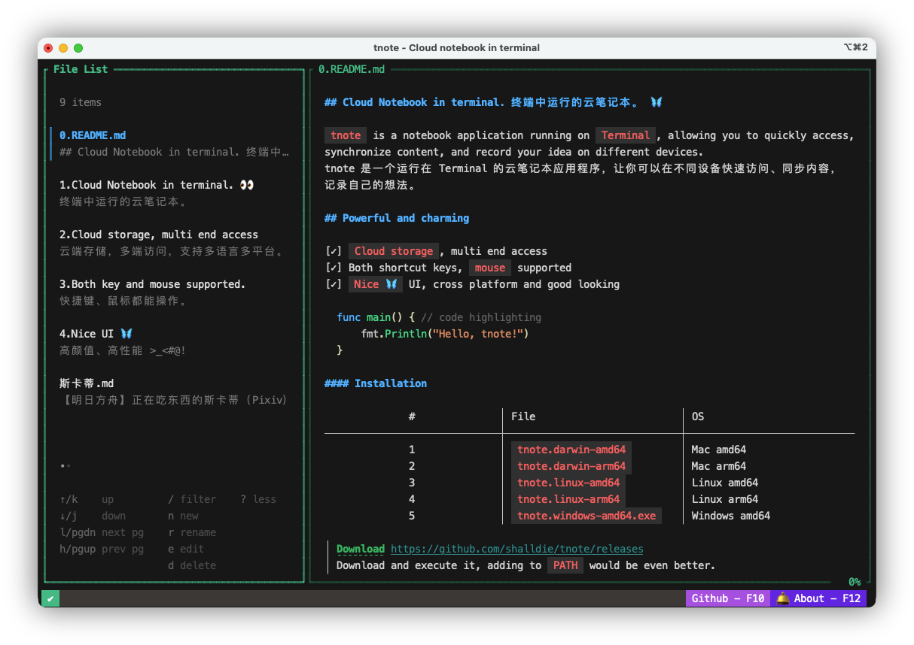

<!-- 中英文切换 -->
<div align="right">

[English](./README.md) | 中文

</div>
<!-- 中英文切换 end -->

<!-- 封面区域 -->
<div align="center">


### Cloud notebook in terminal, based on Gist. 🦋

`终端中的云笔记本，基于 Gist 构建。`

[](https://github.com/shalldie/tnote)
[](https://hub.docker.com/r/shalldie/tnote/tags)
[](https://github.com/shalldie/tnote)
[](https://pkg.go.dev/github.com/shalldie/tnote)
[](https://github.com/shalldie/tnote/actions)
[](https://github.com/shalldie/tnote)



</div>

<!-- 封面区域 end -->

`tnote` 是一个运行在 `Terminal` 的云笔记本应用程序，让你可以在不同设备快速访问、同步内容，记录自己的想法。

- [x] 应用 🎯
  - [x] 快捷键、鼠标操作
  - [x] 云端存储持久化，支持 Github/Gitee
  - [x] 国际化
- [x] 文件
  - [x] 增删查改
- [x] 详情 📝
  - [x] Markdown 高亮
  - [x] 编辑、保存
- [x] 安装
  - [x] binary
  - [x] go install
  - [x] docker

## 准备&配置

应用基于 gist 构建，支持 Github/Gitee 平台。

- [申请 Github access token](https://github.com/settings/tokens/new)，添加到环境变量 `TNOTE_GIST_TOKEN`。
- [申请 Gitee access token](https://gitee.com/profile/personal_access_tokens/new)，添加到环境变量 `TNOTE_GIST_TOKEN_GITEE`。

```bash
# ~/.bashrc, github
export TNOTE_GIST_TOKEN="<your_access_token>"
```

| 环境变量                                      | 默认值  | 描述                                 |
| :-------------------------------------------- | :-----: | :----------------------------------- |
| `TNOTE_GIST_TOKEN` / `TNOTE_GIST_TOKEN_GITEE` |         | 申请到的 access token                |
| `TNOTE_LANG` / `LANG`                         | `en_US` | 使用的语言，可选值：`en_US`、`zh_CN` |

## 安装&运行

### 1. binary

[Download](https://github.com/shalldie/tnote/releases)，下载后直接执行即可，加入 `PATH` 更佳。

|  #  | 文件                      | 适用系统      |
| :-: | :------------------------ | :------------ |
|  1  | `tnote.darwin-amd64`      | Mac amd64     |
|  2  | `tnote.darwin-arm64`      | Mac arm64     |
|  3  | `tnote.linux-amd64`       | Linux amd64   |
|  4  | `tnote.linux-arm64`       | Linux arm64   |
|  5  | `tnote.windows-amd64.exe` | Windows amd64 |

example:

```bash
# install
wget -O tnote [url]
sudo chmod a+x tnote
sudo mv tnote /usr/local/bin/tnote
# run
tnote
```

### 2. go install

需要 `go@1.26+` 环境

```bash
# install
go install github.com/shalldie/tnote/v2@latest
# run
tnote
```

### 3. docker

```bash
docker run -it -e TNOTE_GIST_TOKEN=$TNOTE_GIST_TOKEN shalldie/tnote:latest
```

## LICENSE

MIT
